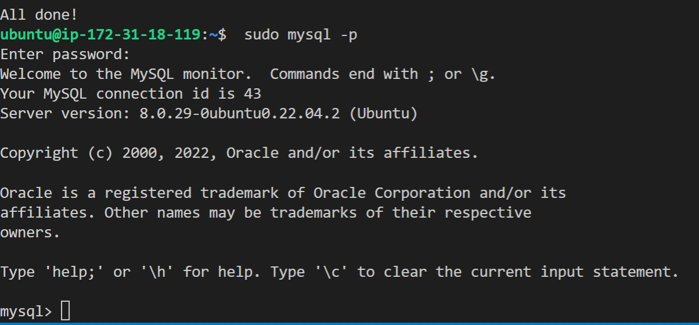
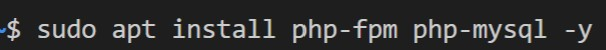

## Create L.E.M.P STACK USING AWS
### The LEMP Stack is another popular stack (Stack of technologies working together) to deploy a websolution but instead of APACHE as the web server we will use NGINX

1. First we deploy an Linux Instance on AWS (In this Case using an Ubuntu AMI)
2. Next we update our Linux machine using the `sudo apt update` command

3. We then install NGINX using `sudo apt install nginx` command 	
4. Confirm it's installed using `sudo systemctl status nginx` If it shows active running in Green you have now launched a web server in the cloud! 
5. Type in http://<Public IP address of Instance running web server>:80 and you should see: 
6. Now we will install our Database we will be using MySQL use the `sudo apt install mysql-server` 
7. Once install use cmd `sudo mysql` to login into the Database. You will be the Admin user ROOT
8. Once inside the DB  You will want to run an Pre-installed Security script that will Lockdown some not secure default settings and access to the DB use `ALTER USER 'root'@'localhost' IDENTIFIED WITH mysql_native_password BY 'Create your PassWord here'; 
9. Use Mysql > exit to close out Mysql
10. Next we will start the Interactive script to Change the password and other settings. to do this we will enter `sudo mysql_secure_installation`
From here you can press Y or N for the following prompts such as changing the Password which you can then use the cmd `sudo mysql -p`  to make sure the new password you created is working 
11. Lastly we will Install PHP. Unlike Apache which automatically has the PHP Process Interpreter NGINX needs to install a separate software for this task. This Decoupling of Software Generally gives PHP processed Web Pages better overall performance. The PHP processor software tells NGINX to pass PHP requests to it we use the `sudo apt install php-fpm` cmd to install this software. We also need to run the `php-mysql` cmd to allow PHP to communicate with our MySql Database 
12. Now we just need to configure the NGINX Server to use the PHP Processor, this allows us to use more than one Server block to encapsulate config details. 
13. We'll use the cmd `sudo mkdir /var/www/projectLEMP` to create our directory and the variable `$USER` to give change the ownership of directory of our Domain. We do this using the CMD `sudo chown -R $USER:$USER /var/www/projectLEMP`
14. Now We activate the configuration by using the cmd `sudo ln -s /etc/nginx/sites-available/projectLEMP /etc/nginx/sites-enabled/` using the configuration from the sites-enabled directory
15. We can test 
